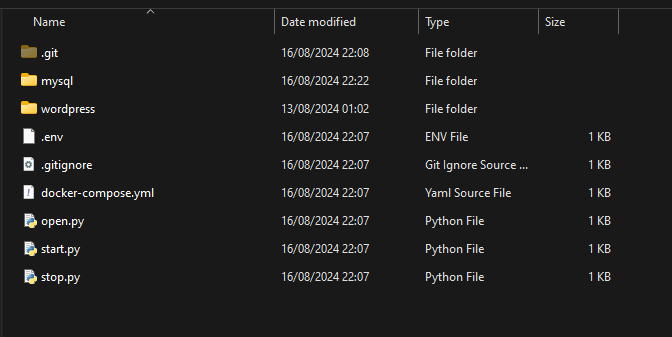

# Script em Python para rodar WordPress localhost

## Iniciar
O arquivo [.env](./.env) contêm as configurações do WordPress e MySQL.  
O Script [start.py](./.start.py) iniciar o Docker.

## Parar
O Script [stop.py](./.stop.py) parar o contêiner.

## Abrir o navegador
O Script [open.py](./.open.py) abre o navegador

## Diretorios

  
O diretório "mysql" contêm arquivos do MySQL.  
O diretório "wordpress" contêm arquivos do WordPress.
